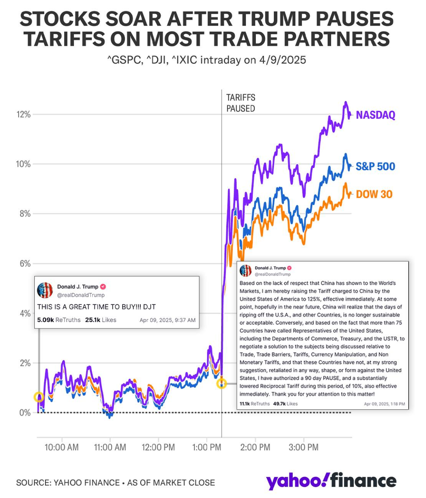

# Event-based stock prediction bot

The goal of this project is to predict and automate stock trades by monitoring technical indicators alongside real-time news, tweets, and social media posts that might move individual stocks in a given direction. We use Generative AI and open-source news APIs to gather, analyze, and act on this information.

Markets do not move only on charts—they move on headlines, policy shocks, and high-impact posts that land in real time. This bot is built to treat those moments as first-class inputs alongside technicals.



## What this repo contains today

At this point repo contaion simple scripts for buy/sell/hold signals, but in the future we plant to add real time Trading bot integration for high speed event based traiding. 

Single entry point: `standalone_stock_analyzer.py` — Yahoo Finance data, technical indicators (RSI, MACD, moving averages, Bollinger Bands), optional **Gemini** news sentiment, and BUY/SELL/HOLD-style signals. Use it as the baseline stack while we add richer event feeds (RSS, social APIs, economic calendars, etc.).

## Setup

```bash
pip install -r requirements.txt
```

Optional: create a `.env` file in this folder with your Gemini key so AI news sentiment runs (technical analysis still works without it):

```
GEMINI_API_KEY=your_key_here
```

Get a key from [Google AI Studio](https://aistudio.google.com/app/apikey).

## Run

```bash
python standalone_stock_analyzer.py
```

On Windows you can use `setup.bat` then `run_analyzer.bat`. On Mac/Linux, `setup.sh` then `./run_analyzer.sh`.

## Disclaimer

For education and information only, not financial advice. Past reactions to events are not a guarantee of future performance.
