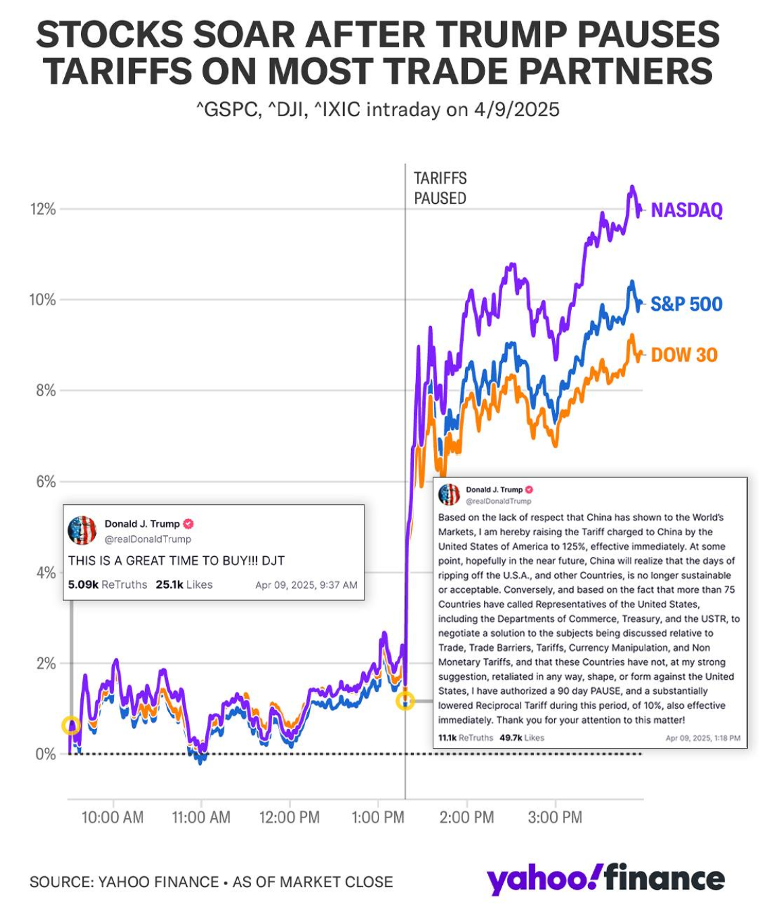

# Event-based stock prediction bot

The goal of this project is to predict and automate stock trades by monitoring technical indicators alongside real-time news, tweets, and social media posts that might move individual stocks in a given direction. We use Generative AI and open-source news APIs to gather, analyze, and act on this information.

Markets do not move only on charts—they move on headlines, policy shocks, and high-impact posts that land in real time. This bot is built to treat those moments as first-class inputs alongside technicals.



## What this repo contains today

Buy/sell/hold signals from technical indicators plus AI news sentiment, a local web dashboard, and a background event feed watching news and social posts. Real-time trade execution is planned, not built.

## Setup

```bash
pip install -r requirements.txt
```

Optional — a `.env` file in this folder enables AI news sentiment (technicals work fine without it):

```
GEMINI_API_KEY=your_key_here
```

Get a free key from [Google AI Studio](https://aistudio.google.com/app/apikey).

## Run

**CLI** — `python standalone_stock_analyzer.py`, or `setup.bat` then `run_analyzer.bat` on Windows, `setup.sh` then `./run_analyzer.sh` on Mac/Linux.

**Web dashboard** — `python -m uvicorn web_app:app --host 127.0.0.1 --port 8000`, or `setup_web.bat` then `run_web.bat` (Windows) / `setup_web.sh` then `./run_web.sh` (Mac/Linux). Opens `http://127.0.0.1:8000`.

Use a **single worker**: the analysis state, scheduler and event poller are per-process singletons, so `--workers N` gives each worker its own copy and multiplies the outbound API calls. The server binds to localhost and has no authentication — if you expose it, put something authenticating in front.

Everything runs locally for now. The eventual hosting plan is `static/` on Cloudflare Pages with the FastAPI backend elsewhere, since Workers can't run pandas/numpy/yfinance.

## Web interface

Shows every metric the CLI computes — RSI, MACD, moving averages, Bollinger position, volume, price targets, news sentiment — each with a plain-English description, plus a Glossary tab.

The watchlist only analyzes when you click **Refresh Now** (or **Analyze**, for custom symbols). Auto-refresh is opt-in from the **Settings** tab (1 minute to 24 hours); it's off by default because a 12-stock burst can trip Gemini's free-tier quota.

## Event Feed

A background poller (`news_sources.py` + `event_state.py`) that watches for market-moving news and social posts, then asks Gemini which company each one concerns and in which direction — including stocks outside the 12-symbol watchlist. Informational only, deliberately kept out of the Watchlist/Custom Analysis signals. Every source is free.

Three sources, each toggleable with its own interval from the Event Feed tab:

- **Google News** — free RSS search, no setup. On by default, every 10 min.
- **Truth Social (Trump)** — via [trumpstruth.org](https://www.trumpstruth.org)'s free RSS mirror (no affordable official API exists). On by default, every 5 min. Being an independent third party it can break without notice; the source-health panel will show it degraded.
- **X / @elonmusk** — **off by default**. X has no free API for reading another account's posts, so this uses a dedicated bot account and Playwright browser automation. That is against X's Terms of Service and carries real risk of the account being locked or banned. Only enable it if you accept that tradeoff.

  One-time setup: `python login_x_bot.py` opens a real browser — log into a **dedicated** account by hand, so you (not a script) handle any CAPTCHA/2FA. The session is saved to `data/x_session_state.json`; treat that file like a password.

The tab shows two lists, on purpose:

- **Latest Posts** — the 5 most recent Truth Social / X posts, as-is and filterable by source. Shown whether or not the AI found a tradeable company in them, so nothing disappears silently.
- **Recent Events** — only the items that resolved to a ticker, with sentiment and confidence. Gemini's ticker guesses are cross-checked against yfinance's company search; an unresolved guess is labeled "unverified" rather than dropped.

A source's first check only seeds its "already seen" state, so a fresh install doesn't push its entire backlog through Gemini at once. If AI analysis starts failing (bad key, exhausted quota) items stay queued and retry on an escalating backoff up to an hour apart, and the tab shows a banner while that lasts.

## Runtime state

Everything mutable lives in `data/` (gitignored), created on first run: settings, dedup state, the pending analysis queue, saved posts, and the X session cookie. Files left in the repo root by an older version are migrated there automatically. Set `APP_DATA_DIR` to keep state outside the checkout.

## Tests

```bash
pip install -r requirements.txt -r requirements-dev.txt
pytest
```

149 tests covering the scoring and target maths, sentiment parsing and its failure paths, RSS parsing, dedup and persistence, job claiming, and API request validation. No network access required — every external call is stubbed.

## Disclaimer

For education and information only, not financial advice. Past reactions to events are not a guarantee of future performance.
